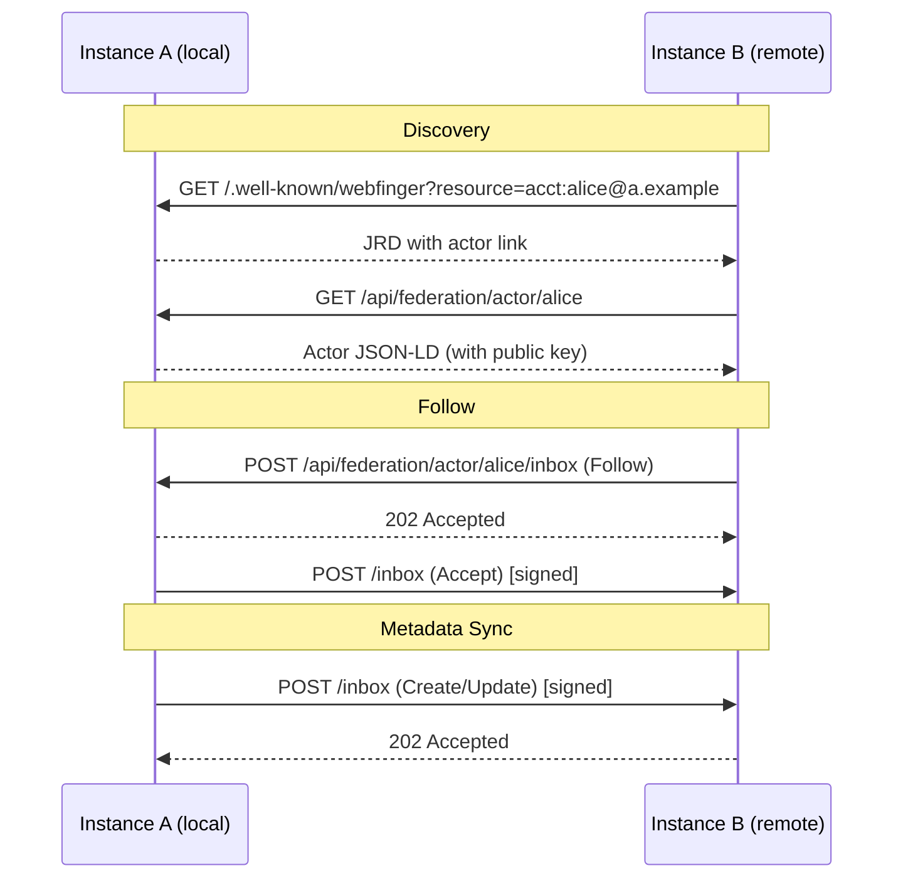

# Federation Architecture

iqoqo supports ActivityPub-based federation for cross-instance collection discovery, metadata synchronization, and server-to-server trust.

## Overview

Federation enables multiple iqoqo instances (and compatible Fediverse servers) to share collection metadata and discover users across organizational boundaries. The implementation follows the **ActivityPub Server-to-Server** (S2S) protocol with HTTP Signatures for authentication.

## Configuration

| Environment Variable             | Default                 | Description                                |
|----------------------------------|-------------------------|--------------------------------------------|
| `FEDERATION_ENABLED`             | `false`                 | Master switch for federation endpoints     |
| `FEDERATION_BASE_URL`            | `http://localhost:3000` | Public URL of this instance                |
| `FEDERATION_AUTO_ACCEPT_FOLLOWS` | `false`                 | Auto-accept follows from trusted instances |
| `FEDERATION_DEFAULT_TRUST`       | `untrusted`             | Default trust level for new instances      |

Set these via the admin Settings panel (Federation category) or as environment variables.

## Endpoints

### Discovery

| Method | Path                           | Description                         |
|--------|--------------------------------|-------------------------------------|
| GET    | `/.well-known/webfinger`       | WebFinger — user discovery          |
| GET    | `/.well-known/nodeinfo`        | NodeInfo — instance discovery links |
| GET    | `/api/federation/nodeinfo/2.1` | NodeInfo 2.1 document               |

### ActivityPub

| Method | Path                                      | Description             |
|--------|-------------------------------------------|-------------------------|
| GET    | `/api/federation/actor/{username}`        | Actor profile (JSON-LD) |
| POST   | `/api/federation/actor/{username}/inbox`  | Per-actor inbox         |
| POST   | `/api/federation/inbox`                   | Shared inbox            |
| GET    | `/api/federation/actor/{username}/outbox` | Outbox (read-only)      |

### Admin API

| Method | Path                                            | Description              |
|--------|-------------------------------------------------|--------------------------|
| GET    | `/api/v1/admin/federation/instances`            | List known instances     |
| POST   | `/api/v1/admin/federation/instances`            | Add/discover instance    |
| PUT    | `/api/v1/admin/federation/instances/{id}/trust` | Update trust level       |
| DELETE | `/api/v1/admin/federation/instances/{id}`       | Remove instance          |
| GET    | `/api/v1/admin/federation/activities`           | Activity log (paginated) |

All admin endpoints require `config:federation` permission.

## Trust Levels

| Level         | Incoming Activities         | Metadata Sync           | Auto-Accept Follows              |
|---------------|-----------------------------|-------------------------|----------------------------------|
| **blocked**   | Rejected (403)              | No                      | No                               |
| **untrusted** | Accepted but not synced     | No                      | No                               |
| **pending**   | Accepted, queued for review | Admin review required   | No                               |
| **trusted**   | Accepted and auto-merged    | Auto-merge empty fields | If `AUTO_ACCEPT_FOLLOWS` enabled |

## HTTP Signatures

All outbound requests are signed using `draft-cavage-http-signatures-12` (Mastodon-compatible):

- **Algorithm**: RSA-SHA256
- **Signed headers**: `(request-target)`, `host`, `date`, `digest`
- **Digest**: SHA-256 of the request body
- **Key ID format**: `{actor_url}#main-key`

Inbound requests are verified by:

1. Parsing the `Signature` header
2. Extracting the `keyId` (actor URI)
3. Fetching the actor's public key (cached in `FederationActor`)
4. Verifying the signature against the specified headers

## Security

### SSRF Prevention

The federation client blocks requests to:

- Private IP ranges (10.x, 172.16-31.x, 192.168.x)
- Loopback addresses (127.x, ::1)
- Link-local addresses (169.254.x, fe80::)
- Cloud metadata endpoints (169.254.169.254)

### Anti-Spoofing

- Actor URI domain must match the `keyId` domain in the HTTP signature
- Activities from blocked instances are rejected at the inbox level (403)

### Payload Limits

- Maximum inbox payload: 100 KB
- Content-Length header validated before reading body

### User Consent

- Users must explicitly opt-in to federation visibility
- Default: federation consent is OFF
- Non-consenting users are invisible to WebFinger and Actor endpoints

## Database Schema

Federation data lives in the `federation` PostgreSQL schema:

- `federation.federation_instances` — Remote instance registry
- `federation.federation_actors` — Cached remote actor profiles
- `federation.federation_followers` — Follow relationships
- `federation.federation_activities` — Activity log (inbound/outbound)
- `federation.federation_consent` — Per-user opt-in settings

Additional columns on `auth.users`:

- `federation_key_id` — The key ID URI for this actor
- `federation_public_key` — PEM-encoded RSA public key

## Key Management

- RSA-2048 keys generated per-user on federation opt-in
- Private keys stored in `data/keys/{user_id}.pem`
- Public keys stored in `auth.users.federation_public_key`
- Keys are used for signing outbound activities

## Async Delivery

Outbound activities are delivered via Celery tasks when Redis is available:

- `deliver_activity()` — Delivers a single activity to a remote inbox
- `process_inbound_activity()` — Processes a received activity

If Celery/Redis is unavailable, delivery falls back to synchronous inline processing.

Retry policy: up to 3 attempts with exponential backoff (handled by `tenacity`).

## Metadata Reconciliation

When a trusted peer sends a `Create` or `Update` activity:

1. The object is matched to a local Manifestation by ISBN or title
2. Empty local fields are populated from the remote data
3. Provenance is tracked via `meta.federation_source`
4. Non-empty local fields are **never** overwritten (local data takes precedence)

For pending peers, merge requests are queued for admin review.

## Interoperability

iqoqo federation is compatible with:

- **Other iqoqo instances** — Full metadata sync support
- **Mastodon/Pleroma/Akkoma** — Follow/Accept/Reject flows
- **Any ActivityPub S2S implementation** — Basic activity delivery

NodeInfo advertises `protocols: ["activitypub"]` and `software.name: "iqoqo"` for instance identification.

## Frontend

### Admin Panel

- **Federation Instances** — Manage remote instances, set trust levels
- **Activity Log** — Monitor inbound/outbound activities with filters
- **Instance Settings** — Toggle federation, set auto-accept, default trust

### User Settings

- **Federation Consent** — Toggle profile and collection federation visibility
- Only shown when `FEDERATION_ENABLED` is true
