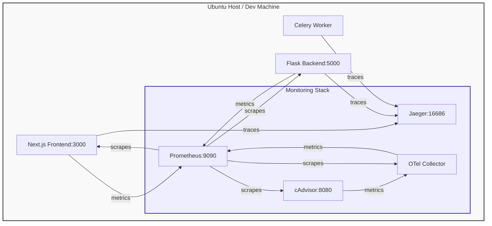

# Observability and Monitoring Guide

This document explains the monitoring architecture for the iqoqo ecosystem, utilizing a local OpenTelemetry, Prometheus, and Jaeger stack for traces and metrics by default, with an option to ship telemetry to Grafana Cloud.

## Architecture Overview

We instrumented multiple layers of the stack to export metrics and traces securely:

1. **System Metrics (Host)**: CPU, Memory, Disk, and Network utilization.
2. **Container Metrics (Docker)**: Real-time container metrics collected via Google's `cAdvisor`.
3. **Backend API (Flask)**: HTTP request latency, status codes, and counts via `prometheus-flask-exporter`, plus OTLP traces.
4. **Frontend UI (Next.js)**: Node.js runtime metrics and HTTP stats via `prom-client`, plus OTLP traces.
5. **Celery Worker**: OpenTelemetry auto-instrumented tracing for background task execution.



## Security & Zero-Trust Constraints

Metrics endpoints (`/metrics`) contain sensitive runtime information. To ensure security, public access is blocked at the Nginx level.

In `deploy/nginx.conf`:

```nginx
# --- BLOCK PUBLIC ACCESS TO METRICS ---
location = /metrics {
    return 404;
}
```

This ensures that:

- External requests to `https://pre.iqoqo.cc/metrics` return a `404 Not Found`.
- Prometheus or Grafana Alloy can safely scrape metrics internally inside the private Docker bridge network (`http://web:5000/metrics`, `http://frontend:3000/metrics`) or locally via `127.0.0.1`.

---

## Prometheus & Jaeger Configuration (Default Local Option)

The local monitoring stack uses the configuration in `deploy/otel-collector-prometheus-config.yaml` for the OpenTelemetry Collector and `deploy/prometheus.yml` for Prometheus.

- **OTel Collector**: Gathers Postgres and Redis metrics internally, then exposes a Prometheus scraping endpoint on port `8889`.
- **Prometheus**: Scrapes the Flask API, Next.js frontend, OTel Collector, and cAdvisor.
- **Jaeger**: Receives OTLP traces directly on loopback ports `4317` and `4318`.

---

## Grafana Alloy Configuration (Grafana Cloud Option)

Alloy uses a declarative configuration located at `deploy/alloy/config.alloy`. It defines the pipeline for gathering metrics/logs and shipping them to Grafana Cloud.

### Key Components

- **`prometheus.remote_write "grafana_cloud"`**: Endpoint for sending collected Prometheus metrics.
- **`loki.write "grafana_cloud"`**: Endpoint for sending log streams.
- **`prometheus.exporter.unix "host"`**: Gathers system metrics (CPU, Memory, Disk, I/O) from the host machine via mounted filesystems.
- **`prometheus.scrape "cadvisor"`**: Collects container resource usage metrics.
- **`discovery.docker "containers"`**: Interacts with the Docker socket to find active containers.
- **`loki.source.docker "docker_logs"`**: Tails logs from all discovered containers automatically.
- **`loki.source.journal "systemd_journal"`**: Collects host OS journal logs.

---

## Deployment Options

### Option A: Standalone Local/Production Prometheus + Jaeger Stack (Default)

A dedicated `docker-compose.monitoring.yml` is provided for running a standalone local Prometheus and Jaeger monitoring stack. This is fully decoupled from the iqoqo application lifecycle.

#### 1. Start the Stack

To deploy the Prometheus, Jaeger, cAdvisor, and OTel Collector stack:

```bash
# Start the monitoring services in background
docker compose -f docker-compose.monitoring.yml up -d
```

Ensure the default docker network `iqoqo_default` exists before running:
```bash
docker network create iqoqo_default || true
```

#### 2. Verify

- Prometheus UI: `http://localhost:9090`
- Jaeger UI: `http://localhost:16686`

---

### Option B: Grafana Cloud Integration (Docker Compose)

For remote cloud monitoring using Grafana Cloud (Alloy + cAdvisor), use `docker-compose.grafana.yml`.

#### 1. Configure Credentials

Add your Grafana Cloud credentials to `.env.preview` (or `.env.prod`):

```bash
# Grafana Cloud Monitoring (Alloy / Prometheus / Loki)
GRAFANA_PROMETHEUS_URL="https://prometheus-prod-01-prod-us-east-0.grafana.net/api/prom/push"
GRAFANA_PROMETHEUS_USER="your_prometheus_user_id"
GRAFANA_LOKI_URL="https://logs-prod-006.grafana.net/loki/api/v1/push"
GRAFANA_LOKI_USER="your_loki_user_id"
GRAFANA_CLOUD_API_KEY="your_grafana_cloud_api_key_or_service_token"
```

#### 2. Start the Stack

Combine the default stack compose with the Grafana descriptor:

```bash
# Start preview/prod mode with Grafana monitoring
docker compose -f docker-compose.yml -f docker-compose.grafana.yml up -d
```

---

### Option C: Native Host OS Deployment

If you prefer to run Grafana Alloy directly on the host (outside Docker):

#### 1. Install Grafana Alloy

On the Ubuntu host, install Alloy via the official Grafana package repository:

```bash
# Add Grafana GPG key
sudo mkdir -p /etc/apt/keyrings/
wget -q -O - https://apt.grafana.com/gpg.key | gpg --dearmor | sudo tee /etc/apt/keyrings/grafana.gpg > /dev/null

# Add APT repository
echo "deb [signed-by=/etc/apt/keyrings/grafana.gpg] https://apt.grafana.com stable main" | sudo tee /etc/apt/sources.list.d/grafana.list

# Install Grafana Alloy
sudo apt-get update
sudo apt-get install alloy
```

#### 2. Configure Environment Variables

Edit `/etc/default/alloy` (or create a systemd override) to set variables:

```bash
GRAFANA_PROMETHEUS_URL="https://prometheus-prod-01-prod-us-east-0.grafana.net/api/prom/push"
GRAFANA_PROMETHEUS_USER="your_prometheus_user_id"
GRAFANA_LOKI_URL="https://logs-prod-006.grafana.net/loki/api/v1/push"
GRAFANA_LOKI_USER="your_loki_user_id"
GRAFANA_CLOUD_API_KEY="your_grafana_cloud_api_key_or_service_token"
FLASK_METRICS_TARGET="127.0.0.1:5000"
NEXTJS_METRICS_TARGET="127.0.0.1:3000"
CADVISOR_TARGET="127.0.0.1:8080"
```

Ensure the `alloy` system user belongs to the `docker` group to read `/var/run/docker.sock`:

```bash
sudo usermod -aG docker alloy
sudo systemctl restart alloy
```

#### 3. Deploy Configuration

Copy the configuration file to the default system path:

```bash
sudo cp deploy/alloy/config.alloy /etc/alloy/config.alloy
sudo systemctl restart alloy
```

---

## Verifying Setup

Once Alloy is running:

1. **Alloy UI**: Access `http://localhost:12345` on the server (or tunnel it) to verify that all scrape targets are **Up** and healthy.
2. **Grafana Explore**:
   - Go to your Grafana Cloud instance.
   - Use the **Explore** tab.
   - Select your Prometheus data source and query: `up` or `{job="flask_app"}`.
   - Select your Loki data source and query: `{container="iqoqo-web"}` or `{job="docker_logs"}` to see active logs.
