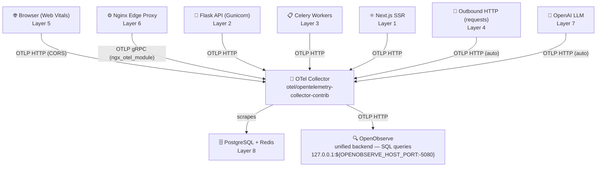

# Monitoring & Observability

iqoqo ships a **Zero Blind Spot** observability stack built on OpenTelemetry (OTel).
All 8 layers of the platform are instrumented. Telemetry flows through a single OTel
Collector gateway into a unified backend that accepts traces, metrics, and logs over
the same OTLP endpoint.

## Architecture Overview


```mermaid
graph TD
    B["🌐 Browser (Web Vitals)<br/>Layer 5"]
    N["⚙️ Nginx Edge Proxy<br/>Layer 6"]
    F["🐍 Flask API (Gunicorn)<br/>Layer 2"]
    C["📋 Celery Workers<br/>Layer 3"]
    NX["⚛️ Next.js SSR<br/>Layer 1"]
    H["🔗 Outbound HTTP (requests)<br/>Layer 4"]
    LLM["🤖 OpenAI LLM<br/>Layer 7"]
    DB["🗄️ PostgreSQL + Redis<br/>Layer 8"]

    B -->|"OTLP HTTP (CORS)"| COL
    N -->|"OTLP gRPC (ngx_otel_module)"| COL
    F -->|"OTLP HTTP"| COL
    C -->|"OTLP HTTP"| COL
    NX -->|"OTLP HTTP"| COL
    H -->|"OTLP HTTP (auto)"| COL
    LLM -->|"OTLP HTTP (auto)"| COL
    COL -->|"scrapes"| DB

    COL["📡 OTel Collector<br/>otel/opentelemetry-collector-contrib"]
    COL -->|"OTLP HTTP"| OO

    OO["🔍 OpenObserve<br/>unified backend — SQL queries<br/>127.0.0.1:${OPENOBSERVE_HOST_PORT:-5080}"]
```

## Default Stack: OpenObserve

OpenObserve (`openobserve/openobserve`) is a single Rust binary that natively accepts
traces, metrics, and logs over OTLP. Data is stored in compressed Apache Parquet files.
Queries use standard ANSI SQL — no PromQL, no LogQL.

### Start

The monitoring stack is composed together with the main stack by `run.sh`; there
is no separate target.

```bash
./run.sh dev      # bare host: OpenObserve on ${OPENOBSERVE_HOST_PORT:-5080}
./run.sh preview  # or prod: full docker compose, monitoring file included
```

### Access

| Interface          | URL                                                                        |
| ------------------ | -------------------------------------------------------------------------- |
| **OpenObserve UI** | `http://localhost:5080` (or `$OPENOBSERVE_HOST_PORT`)                      |
| **Login**          | `admin@iqoqo.local` / `<auto-provisioned in .env>`                         |
| **SQL REST API**   | `POST http://127.0.0.1:${OPENOBSERVE_HOST_PORT:-5080}/api/default/_search` |
| **OTLP gRPC**      | `localhost:4317` (or `$OTEL_GRPC_HOST_PORT`)                               |
| **OTLP HTTP**      | `localhost:4318` (or `$OTEL_HTTP_HOST_PORT`)                               |

### Multi-Stack Port Collision Avoidance

When running `prod` and `preprod` on the same machine, override host ports in `.env`:

```bash
# preprod .env
OPENOBSERVE_HOST_PORT=5081
OTEL_GRPC_HOST_PORT=4319
OTEL_HTTP_HOST_PORT=4320
```

### Stop

The monitoring stack shares its lifecycle with the main stack:

```bash
./run.sh preview --stop
# or, to tear down just the monitoring services:
docker compose -f docker-compose.monitoring.yml down
```

### Automated Health Verification

Run `make status` to inspect container health and telemetry ingestion status across your environment:

```bash
make status
# or for preview/prod stacks:
make status STACK=preview
make status STACK=prod
```

`make status` validates:

- OpenObserve health at `${OPENOBSERVE_HOST_PORT:-5080}/healthz`
- OTel Collector readiness at `:8888`
- Coherence between configured `OTEL_*_EXPORTER` flags and OTel Collector reachability

---

## Instrumented Layers

All 8 platform layers are instrumented via OpenTelemetry auto-instrumentation and custom span hooks:

| # | Layer                            | Mechanism                                            | Signal                        |
| - | -------------------------------- | ---------------------------------------------------- | ----------------------------- |
| 1 | **Frontend SSR (Next.js)**       | `@vercel/otel` via `frontend/instrumentation.ts`     | Traces, Metrics               |
| 2 | **Flask Backend (Gunicorn)**     | `opentelemetry-instrument gunicorn` + `request_hook` | Traces, Metrics, Logs         |
| 3 | **Celery Workers**               | `opentelemetry-instrument celery` + `request_hook`   | Traces, Metrics, Logs         |
| 4 | **Outbound HTTP (requests)**     | `opentelemetry-instrumentation-requests`             | Traces                        |
| 5 | **Browser Web Vitals**           | `BrowserTelemetry` React component + OTel Web SDK    | Traces                        |
| 6 | **Nginx Edge Proxy**             | `ngx_otel_module.so` (via `deploy/Dockerfile.nginx`) | Traces                        |
| 7 | **OpenAI LLM**                   | `opentelemetry-instrumentation-openai`               | Traces (token usage, prompts) |
| 8 | **PostgreSQL & Redis Internals** | OTel Collector `postgresql` + `redis` receivers      | Metrics                       |

---

## Trace Security & Sanitization

To ensure credentials and sensitive tokens never leak into OpenObserve or persistent trace storage:

- `app/core/telemetry.py` defines `request_hook(span, environ)` which intercepts incoming WSGI request headers.
- Any request containing an `Authorization` header has its span attribute (`http.request.header.authorization`) sanitized to `[REDACTED]`.
- Token redaction operates automatically under both standalone Flask dev servers and `opentelemetry-instrument gunicorn` execution.

---

## Browser Real User Monitoring (RUM) & Logs

Frontend telemetry is forwarded directly from client browsers to OpenObserve by
`frontend/components/browser-openobserve-rum.tsx`, which initialises the
`@openobserve/browser-rum` and `@openobserve/browser-logs` SDKs and starts
session replay recording.

### ⚠️ Security Posture — Read Before Enabling

**The RUM client token is a public credential.** It is a write-only bearer
token that necessarily reaches the browser, so anyone who can view the page
source can read it. It grants **unauthenticated write access** to the RUM
stream. A reader of this token can:

- inject arbitrary RUM events and metrics;
- upload arbitrary **session replay** frames;
- inject arbitrary log lines via `forwardErrorsToLogs`, including URLs with
  their query strings (which carry search queries and item titles);
- write arbitrary stream fields (`service`, `version`, `env`, …), which feed
  your own dashboards.

Treat every field in the RUM stream as **untrusted input**, and treat the token
as a spam/abuse vector rather than as an authentication secret.

**Retention is not configured.** No `ZO_*` retention or stream-setting variable
exists anywhere in this repository, so OpenObserve's default applies:
unlimited. That is a deliberate fit for ad-hoc debugging — you keep everything
until you look at it — but note the property that follows from it. RUM logs land
in `_rumlog` and session replays are stored as blobs under `/data` in the
`openobserve_data` volume, which lives on the **host disk next to the Postgres
and Redis data**. Since the write path is unauthenticated and unbounded, a
determined party can grow that volume without limit; filling the host disk takes
down iqoqo itself, not just telemetry. **The loopback bind on OpenObserve
(`docker-compose.monitoring.yml`) is the only control preventing a remote party
from writing to it at all.**

Practical guidance, given ad-hoc debug is the intent:

- Set a **short** retention window, not a long one. A bound costs nothing and
  removes the disk-exhaustion path entirely. `make status` warns at 80% disk,
  but by then the volume has already been growing for a while.
- The exposure is proportional to whether the deployment is reachable by other
  people. Loopback-only and single-user, this is a non-issue in practice.
- Anything internet-facing should not treat OpenObserve as durable storage.

Other stream fields are equally attacker-writable: `service`, `version`, `env`,
and error URLs with query strings all arrive with the token. Treat every field
in the RUM stream as untrusted input.

**Session replay masks user input by default.** The privacy level defaults to
`mask-user-input` in every environment, and production refuses to be overridden.
Raising it to `allow` records DOM text and keystrokes unmasked — do so only on
a throwaway instance.

**The provisioning step uses the OpenObserve root credential.** OpenObserve
`v0.91.5` offers no RUM-scoped service account, so the provisioning step
authenticates with full administrative access on every deployment. That
credential is read from the environment only — never from a command-line
argument, never interpolated into a script, and never logged — but the request
originates from a developer workstation on each `./run.sh`. Separately,
`OPENOBSERVE_BASIC_AUTH` is passed into the collector container's environment
and is therefore visible to any local user via `docker inspect` or
`/proc/<pid>/environ`.

### Verified Management Contract

| Property         | Value                                                                          |
| ---------------- | ------------------------------------------------------------------------------ |
| Endpoint         | `GET /api/default/rumtoken` — server-side get-or-create, idempotent            |
| Authentication   | HTTP Basic, root credential — `Authorization: Basic ${OPENOBSERVE_BASIC_AUTH}` |
| Response         | `{"data": {"user": "...", "rum_token": "..."}}`                                |
| Verified against | `openobserve/openobserve:v0.91.5`                                              |

Called from `run.sh` via `scripts/provision_rum_token.py`. No other OpenObserve
management API is used anywhere in the repository.

**Re-verify on any image bump.** A `404` on a newer tag means the route moved,
not that RUM is misconfigured — the provisioner reports the image tag in use and
the tag it was verified against so this is diagnosable from the log line alone.

### Browser Ingest Contract

What the SDK actually builds (`@openobserve/browser-core`, `endpointBuilder.js`):

```text
${insecureHTTP ? 'http' : 'https'}://${site}/rum/${apiVersion}/${org}/${trackType}
    ?o2source=browser&o2-api-key=${clientToken}&batch_time=...&_o2.api=...
```

Consequences worth knowing:

- **`site` is a bare `host[:port]`, with no scheme.** The SDK supplies the
  protocol itself and `buildEndpointHost()` returns `site` verbatim, so a value
  like `localhost:5080` is the correct form — that is also why
  `browser-openobserve-rum.tsx` passes `window.location.host`. A configured site
  containing a scheme would build `https://https://host/...`.
- **`apiVersion` defaults to `v1`**, giving the `/rum/v1/...` path.
- **The token travels as the `o2-api-key` query parameter** — not a header and
  not a body field.
- **`applicationId` is payload metadata, not a routing key.** The ingest route
  is keyed on org and API version only, so a value differing from the
  OpenObserve-generated application identifier does not cause ingest rejection.
- **The `/rum/` prefix is what the nginx route matches**, which is why
  `deploy/nginx.conf` proxies `/rum/` rather than a per-stream path.

Verified by direct ingest against `v0.91.5`: `_rumdata` and `_rumlog` both
return `successful: 1, failed: 0` and the events are queryable over `_search`.

The provisioner targets `http://127.0.0.1:${OPENOBSERVE_HOST_PORT}`, a
non-configurable loopback literal. It reads credentials from the environment,
uses `http.client` (which has no proxy support and never follows redirects), and
**never writes the token to a file or prints it** — diagnostics carry the
outcome, not the value.

### Environment Configuration

Two topologies ship, and the ingest target is validated against them before the
token is handed to the browser.

| Variable                                     | Read by                                      | Purpose                                                           |
| -------------------------------------------- | -------------------------------------------- | ----------------------------------------------------------------- |
| `OPENOBSERVE_RUM_CLIENT_TOKEN`               | `frontend/app/layout.tsx` (server), `run.sh` | Per-request token. Absent ⇒ RUM disabled cleanly.                 |
| `OPENOBSERVE_RUM_SITE`                       | `frontend/app/layout.tsx` (server)           | Ingest target. Unset ⇒ the page host is used.                     |
| `OPENOBSERVE_RUM_INSECURE_HTTP`              | `frontend/app/layout.tsx` (server)           | Transport override. Unset ⇒ derived from the page's own protocol. |
| `OPENOBSERVE_RUM_PRIVACY_LEVEL`              | `browser-openobserve-rum.tsx`                | Session replay masking. Defaults to `mask-user-input`.            |
| `OPENOBSERVE_RUM_ENV`                        | `browser-openobserve-rum.tsx`                | `development` / `production` / `test` (`test` disables the SDKs). |
| `OPENOBSERVE_RUM_ORG_ID`                     | `browser-openobserve-rum.tsx`                | Defaults to `default`.                                            |
| `OPENOBSERVE_RUM_API_VERSION`                | `browser-openobserve-rum.tsx`                | Defaults to `v1`.                                                 |
| `NEXT_PUBLIC_OPENOBSERVE_RUM_APPLICATION_ID` | `browser-openobserve-rum.tsx`                | Application identifier. Defaults to `iqoqo`.                      |

> **These are server-side variables, read per request — not build args.**
> `NEXT_PUBLIC_*` values are inlined into the client bundle by the Next.js
> compiler at **build** time. `--prebuilt` deployments pull the frontend image
> from a registry where it was built on CI, so a per-instance build ARG would
> either be impossible to set or would bake one instance's token into a shared
> image. The root layout therefore reads a non-public variable at request time
> and passes it to the client component as a prop. Because the token is public by
> construction, this changes nothing about what an attacker can do with it.

#### `dev` — bare host, HTTP, loopback

`run.sh` provisions the token and points the browser at the loopback literal.
Plaintext ingest is permitted here and only here, because the browser and
OpenObserve share the operator's own machine.

```bash
MODE=dev ./run.sh
# rum-token: PROVISIONED topology=loopback — browser RUM targets this machine only.
```

#### `preview` / `prod` — dockerized, HTTPS

The browser cannot reach a loopback-bound OpenObserve, so ingest is routed
through nginx and must use the deployment's own public origin over TLS. The
provisioner refuses a loopback target on these modes — pointing a remote
browser at `localhost` would send the token to each visitor's own machine.

```bash
MODE=prod ./run.sh
# rum-token: PROVISIONED topology=public-origin — browser RUM targets this deployment's own origin over TLS.
```

This requires all of:

1. `OPENOBSERVE_RUM_SITE` set to the deployment's own public origin
   (e.g. `https://preview.iqoqo.cc`).
2. A `/rum/` route in `deploy/nginx.conf` proxying to `openobserve:5080` —
   present by default, rate-limited, never buffered or cached.
3. The public origin permitted in `ZO_CORS_ALLOWED_ORIGINS`, which
   `docker-compose.monitoring.yml` derives from `NEXT_PUBLIC_FRONTEND_URL`
   (override with `OPENOBSERVE_CORS_ORIGINS`).

If any of these is missing, RUM is left disabled with a warning rather than
misconfigured. Set `RUM_LOCAL_ONLY=true` to force loopback behaviour on a
non-local mode.

If `OPENOBSERVE_RUM_CLIENT_TOKEN` is unset or empty, the frontend skips browser
RUM initialization without throwing.

### Diagnosing RUM

Every outcome is one greppable `rum-token:` line on the deploy log:

| Line fragment                                 | Meaning                                                                                |
| --------------------------------------------- | -------------------------------------------------------------------------------------- |
| `PROVISIONED topology=loopback`               | Token provisioned; browser targets this machine.                                       |
| `PROVISIONED topology=public-origin`          | Token provisioned; browser targets this deployment's origin over TLS.                  |
| `reason=existing`                             | The existing token was reused, unchanged.                                              |
| `DEGRADED reason=not-ready`                   | OpenObserve did not answer within the budget (`RUM_READY_BUDGET_SECONDS`, default 20). |
| `DEGRADED ... authentication rejected`        | The root credential is wrong or was rotated — check `OPENOBSERVE_BASIC_AUTH`.          |
| `DEGRADED ... absent on image tag`            | The route is gone on this OpenObserve version.                                         |
| `DEGRADED ... redirect; not followed`         | A 3xx was refused so the root credential could not be replayed.                        |
| `DEGRADED reason=ingest-site-rejected`        | The configured ingest target is unsafe for this deployment.                            |
| `SKIPPED reason=monitoring-stack-not-started` | Tracing is disabled or the monitoring compose file is absent.                          |

RUM is optional telemetry: no failure mode here aborts a deployment.

To confirm events are arriving:

```bash
curl -s -X POST "http://127.0.0.1:${OPENOBSERVE_HOST_PORT:-5080}/api/default/_search" \
  -H "Authorization: Basic ${OPENOBSERVE_BASIC_AUTH}" \
  -H "Content-Type: application/json" \
  -d '{"query":{"sql":"SELECT _timestamp, service, browser_url FROM _rumlog ORDER BY _timestamp DESC LIMIT 20"}}' | jq '.hits'
```

### Troubleshooting the Provisioner

Two environment properties bite here, and both present as a misleading symptom.

**1. `ZO_ROOT_USER_PASSWORD` must satisfy OpenObserve's strength policy.**
OpenObserve requires 8–128 characters with at least one lowercase letter, one
uppercase letter, one digit, and one special character. On a **fresh** data
volume a password that fails this policy does not merely fail authentication —
OpenObserve *panics during startup* and the container crash-loops:

```text
ZO_ROOT_USER_PASSWORD is too weak: Password must be 8-128 characters and
contain at least one lowercase letter, one uppercase letter, one digit,
and one special character.
```

`scripts/ensure_env_secrets.py` generates `secrets.token_urlsafe(32)`, which
satisfies the policy, so an auto-provisioned password is fine. A hand-written
one may not be.

**2. The password is applied at initialisation only.** `ZO_ROOT_USER_PASSWORD`
seeds the root user when the data volume is first created; changing it later in
the env file does **not** re-apply it. The symptom is a healthy container that
answers `401` to the current credential, with no error anywhere:

```text
rum-token: DEGRADED reason=provision-failed detail=authentication rejected
```

There is no supported in-place password change, so recovery means removing the
data volume and letting OpenObserve re-initialise — which **discards all
telemetry** in it. Confirm the container's password and the env file's really
are identical before concluding they are not:

```bash
docker inspect <project>-openobserve --format '{{range .Config.Env}}{{println .}}{{end}}' \
  | grep '^ZO_ROOT_USER_PASSWORD=' | cut -d= -f2- | tr -d '\n' | sha256sum
grep '^OPENOBSERVE_ROOT_PASSWORD=' "$ENV_FILE" | cut -d= -f2- | tr -d '"' | sha256sum
```

If the hashes match yet auth still fails, the volume holds an older password.

**3. Env files are `source`d, so `$` in a secret breaks the read path.**
`run.sh` and the `make preview-up` recipe both read the env file with
`set -a; . "$ENV_FILE"`. Shell-active characters — `$`, a backtick, a backslash,
a quote — are therefore interpreted on the *read* path, so the value in the
process can differ from the value on disk even though the file is correct. Keep
generated credentials free of those characters; `update_env_var` escapes them on
the write path, but `source` is not escapable.

### Known Follow-ups

These were surfaced while hardening this path and are deliberately **not**
fixed here:

1. **No RUM retention is configured.** Acceptable for ad-hoc debugging, but it
   leaves the `openobserve_data` volume unbounded on the host disk. A short
   retention window removes the disk-exhaustion path at no cost. See the
   security posture section above.
2. **No healthcheck on the `openobserve` service.** `docker compose up -d`
   returns immediately, so `run.sh` hand-rolls a readiness wait and `make
   status` cannot distinguish a wedged container from a starting one. Adding
   one would make the bounded wait near-zero in the common case.
3. **`.env.bak.*` snapshots are never pruned.** Every key rotation leaves
   timestamped secret-bearing copies in the repository root, indefinitely.
4. **`HTTP_PROXY` in `.env` is still a credential-exfiltration path** for any
   *other* `curl` in the deployment. The RUM provisioning step is immune —
   `http.client` has no proxy support — but `scripts/iqoqo-status.sh` and the
   OTLP paths are not. `curl --disable --noproxy '*'` would close it.
5. **`NEXT_PUBLIC_OPENOBSERVE_RUM_APPLICATION_ID` defaults to `iqoqo`** while
   `/api/default/rumtoken` uses an OpenObserve-generated application
   identifier. If they differ, OpenObserve rejects every ingest payload and RUM
   is silently dead. This needs a live check against a running instance with
   valid credentials.

---

## AI-First Observability: SQL Queries

Because OpenObserve uses standard ANSI SQL, AI agents and SREs can execute queries via HTTP REST API without manual browser navigation.

### HTTP 5xx Server Errors (last 1 hour)

```bash
curl -s -X POST "http://127.0.0.1:${OPENOBSERVE_HOST_PORT:-5080}/api/default/_search" \
  -H "Authorization: Basic ${OPENOBSERVE_BASIC_AUTH}" \
  -H "Content-Type: application/json" \
  -d '{
    "query": {
      "sql": "SELECT _timestamp, service_name, http_status_code, http_target FROM default WHERE http_status_code >= 500 AND _timestamp > now() - interval 1 hour ORDER BY _timestamp DESC LIMIT 20"
    }
  }' | jq '.hits'
```

### Recent Celery Exception Tracebacks

```bash
curl -s -X POST "http://127.0.0.1:${OPENOBSERVE_HOST_PORT:-5080}/api/default/_search" \
  -H "Authorization: Basic ${OPENOBSERVE_BASIC_AUTH}" \
  -H "Content-Type: application/json" \
  -d '{
    "query": {
      "sql": "SELECT _timestamp, log FROM default WHERE service_name = '\''iqoqo-celery-worker'\'' AND log LIKE '\''%Traceback%'\'' ORDER BY _timestamp DESC LIMIT 10"
    }
  }' | jq '.hits'
```

### Average Memory per Container (last 15 min)

```sql
SELECT container_name, AVG(memory_usage_bytes) / 1024 / 1024 AS avg_memory_mb
FROM metrics
WHERE _timestamp > now() - interval 15 minute
GROUP BY container_name
ORDER BY avg_memory_mb DESC
```

### PostgreSQL Cache Hit Ratio

```sql
SELECT blks_hit, blks_read, blks_hit / (blks_hit + blks_read + 0.001) AS cache_hit_ratio
FROM metrics
WHERE __name__ = 'postgresql.blocks_read'
ORDER BY _timestamp DESC LIMIT 1
```

---

## Security

- All host ports are bound to `127.0.0.1` — telemetry never leaks to public network interfaces.
- The Nginx `/metrics` location is blocked (returns `404`) at the virtual host level in `deploy/nginx.conf`.
- The OTel Collector and OpenObserve communicate over the internal `iqoqo_default` Docker bridge network.
- The Docker socket is mounted **read-only** (`/var/run/docker.sock:ro`) into the OTel Collector for `docker_stats` scraping only.
- CORS is restricted to `localhost:3000` and `dev.iqoqo.cc` for browser-side OTLP ingestion.

---

## Configuration Files

| File                                        | Purpose                                        |
| ------------------------------------------- | ---------------------------------------------- |
| `docker-compose.monitoring.yml`             | **Default** OpenObserve + OTel Collector stack |
| `deploy/otel-collector-local.yaml`          | OTel Collector config (OpenObserve backend)    |
| `deploy/Dockerfile.nginx`                   | Custom Nginx with `ngx_otel_module` (Layer 6)  |
| `deploy/nginx-main.conf`                    | Nginx main config loading OTel C-module        |
| `frontend/instrumentation.ts`               | Next.js server-side OTel bootstrap (Layer 1)   |
| `frontend/components/browser-telemetry.tsx` | Browser-side OTel bootstrap (Layer 5)          |
