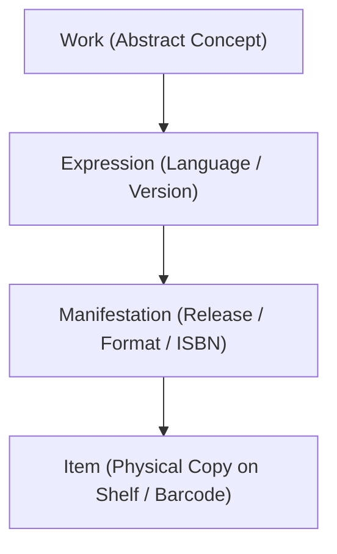

# OpenSpec Specification: FRBR Ontology Boundaries

## Purpose

This specification defines the boundary rules for the four-tier Functional Requirements for Bibliographic Records (FRBR) ontology implemented in iqoqo.

## Requirements

### Requirement: Four-Tier FRBR Hierarchy

All media cataloged in iqoqo MUST align with the four-tier FRBR standard hierarchy (Work -> Expression -> Manifestation -> Item).

#### Scenario: Validating FRBR Hierarchy Structure

- **WHEN** domain entities are processed or stored
- **THEN** entity relationships strictly follow Work -> Expression -> Manifestation -> Item.

All media cataloged in iqoqo must align with the FRBR standard:

1. **Work:** The conceptual creation (e.g., _The Lord of the Rings_ by J.R.R. Tolkien). Holds titles, authors, and abstract subjects. Contains no language, format, or physical attributes.
2. **Expression:** The realization of a Work (e.g., Maria Skibniewska's Polish translation, or the original English text). Holds language, translator, or performance details. Contains no physical attributes or ISBN.
3. **Manifestation:** The physical or digital release/edition (e.g., the 2002 Muza Hardcover Edition, ISBN 978-83-7495-312-2). Holds formats, publishers, release dates, EAN/ISBN codes, and cover art.
4. **Item:** The single physical or digital copy owned by a user (e.g., the copy on Shelf 3B, barcode `123456789`). Holds condition, location, acquisition dates, pricing, lending status, and custom notes.

### Requirement: Type Mutability

The system SHALL allow the core `type` attribute of an existing FRBR entity (Work, Expression, Manifestation, or Item) to be modified, provided the change maintains ontological boundaries.

#### Scenario: Backend Type Update

- **WHEN** a valid API request is made to change the `type` of a Manifestation
- **THEN** the system updates the `type` field while leaving any existing type-specific metadata (e.g., `meta` JSON) intact for potential future data migration

### Requirement: Upward Type Propagation

When a Manifestation's `type` is modified, the system SHALL adapt the parent Work and Expression upwards to ensure the new type is correctly covered without limiting to other types in the future.

#### Scenario: Upward Type Adaptation

- **WHEN** a Manifestation's `type` is changed
- **THEN** the system ensures the parent Expression and Work types are adapted upwards to remain ontologically consistent with the new Manifestation type

## 2. Ontological Boundary Rules

### A. Attributes Assignment

- **No Physical Attributes on Work/Expression:** Barcodes, conditions, acquisition dates, shelf locations, or lending logs must NEVER be attached to a Work or Expression.
- **No Format Attributes on Work:** Format details (CD, Vinyl, Hardcover, DVD), publishers, or ISBNs must NEVER be attached directly to a Work.
- **No Virtual Identity Mixup:** Virtual items on the wishlist (where the Item entity is not present, or has `id < 0`) are purely conceptual or representative. They represent the intent to own, but they do NOT have physical shelf placement, barcode scanner associations, or active lending availability.

### B. Metadata Verification & Fallbacks

- External catalog lookup services (e.g., ISBN, Allegro, BGG, Discogs, TMDB) must fail gracefully.
- If no external metadata is found, the system must present the manual entry fallback view.
- Under no circumstances should the system generate dummy cover art, placeholder barcodes, or mock ISBNs.

## 3. Database & API Validation Guards

- The backend decorator `@require_physical_item` must screen incoming payloads to ensure mutating endpoints (such as lending or editing physical item properties) are only called for actual physical items (where `id > 0` and entity is an Item).
